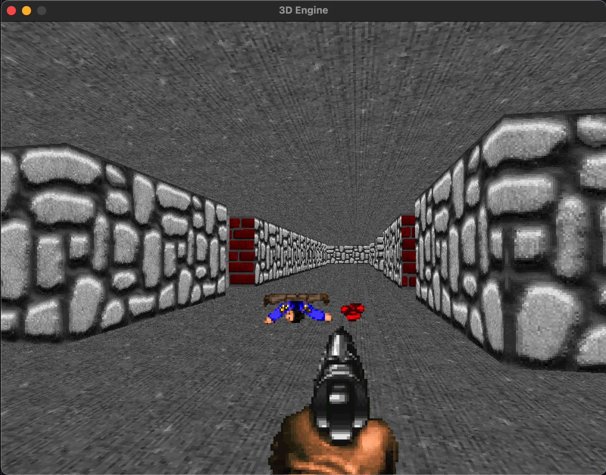

# WOLFENSTEIN 3D CLONE

## ScreenShot



## BUILD DEPENDENCIED

- CMAKE
- GLEW
- GLM
- SDL

## For installing depenndencies on Linux/Unix based OS (use your package manager):

Eg., for Mac (using homebrew) :

```
brew install cmake sdl2 glew glm
```

## Building the Project

- Open Terminal and run :

```
mkdir build
cd build
cmake ../
make
```

- After above step a executable named `wolfenstein3d` will be formed in the build folder
- Run the executable to run the game..
